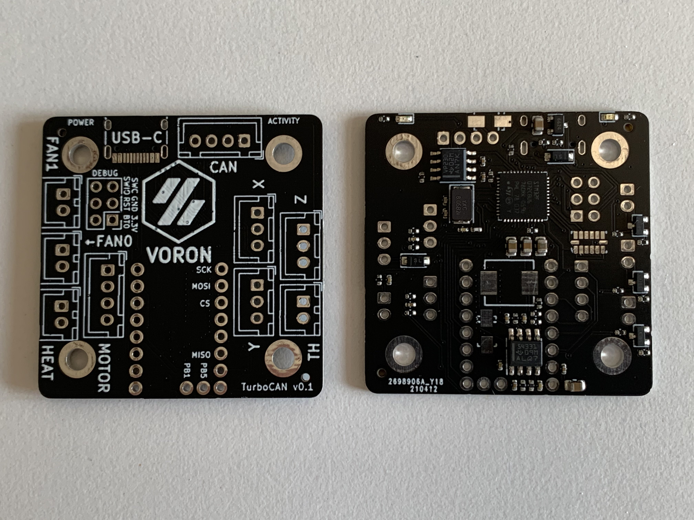
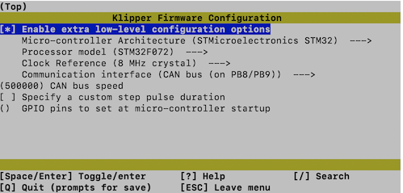

# TurboCAN

This is the official repository for the TurboCAN controller board, designed specifically for the [Voron AfterBurner] toolhead but can also be used on similar toolheads using NEMA17 steppers. The main benefit of this board is the capability to run the toolhead over just 4 wires (CAN, +24V, Ground) which greatly simplifies the wiring in the Voron v1 and v2 models.

[Voron AfterBurner]: https://github.com/VoronDesign/Voron-Afterburner

## Features

* 1x Combined CAN-bus and 24V power port with polarity protection
* 1x ADXL345 accelerometer for use with Klipper's input shaper feature
* 1x 24V stepper stick mount and motor output
* 3x 24V MOSFET fan0/fan1/heater outputs (up to 3A)
* 2x 5V powered endstop inputs (marked X/Y), could be used for toolhead mounted endstops (microswitch or hall effect), filament runout sensor or 5V Z probe.
* 1x 24V powered endstop input (marked Z) with built-in BAT42 diode, used for inductive probe on the AfterBurner but also supports microswitch based probing (e.g. Magprobe).
* 1x Thermistor input with 4.7k pullup resistor
* 1x USB-C port
* 1x SWD debug port with BOOT0/RESET broken out
* 5V 3A buck converter (available externally on X/Y endstops) and 3.3V 200mA linear regulator (internal only)
* Power LED & Activity (PA1) LED

The board supports interfacing with Klipper both over CAN and USB-C (selectable when building the Klipper firmware).

## Use cases

The TurboCAN board is actually not only useful as a toolhead board, here are some reasons why you want more of them:

* Want even less wiring? TurboCAN fits on the back of any NEMA17 stepper, so you can mount TurboCAN boards on e.g. the A/B (or X/Y) steppers and run them over a shared CAN bus.
* Need a USB to CAN interface? TurboCAN can do USB and CAN at the same time, so you can flash CandleLight firmware and use it as a USB-CAN interface.
* Want input shaper but annoyed by the complicated SPI wiring needed for the ADXL345 board? Just use a spare TurboCAN board over USB(/CAN) instead.

## Current status

**WARNING:** While the author has a working printer running a TurboCAN v0.1 board, this project is in early development, and most likely still has undiscovered issues. Build one at your own risk!

- [x] v0.1 boards ordered
- [x] v0.1 boards testing
  - [x] LEDs
  - [x] 3.3v LDO
  - [x] SWD debug port
  - [x] USB interface
  - [x] Buck converter
  - [x] Stepper stick
  - [x] MOSFET outputs
  - [x] CAN-bus + Flashing Klipper (CAN)
  - [x] Thermistor input
  - [x] X/Y endstop inputs
  - [x] Z endstop input

## Getting started

1. Configure Klipper using `make menuconfig`:

2. Put a jumper between `BOOT0` and `3.3V` and power cycle the board.

3. Flash the TurboCAN board using `make flash FLASH_DEVICE=1234:ABCD` (replace USB vendor/product, you find them with `lsusb`).

4. Connect the TurboCAN board using your favorite CAN bus interface (or use another TurboCAN board, see below).

5. Run the `klipper/scripts/canbus_query.py` command to determine the CAN address. See [Klipper docs](https://www.klipper3d.org/CANBUS.html) for more info.

6. Use the [provided Klipper config](klipper/turbocan.cfg) as a starting point.

## Changelog

### v0.2

* Errata fixes
  * LEDs are now mounted the right way.
  * R11 connected to R10/VSENSE.
  * SPI bus to the ADXL345 now have MISO/MOSI on the right pins.
  * Z probe input now has filtering and pullup resistor.
  * Reworked buck converter compensation circuitry.
  * Added CAN termination resistor.
* Added 100uF bulk capacitor for 24V to mitigate voltage fluctuations due to long cables.
* Thermistor resistor is now in 0805 package (was 0402) to simplify replacement to 1k (for PT1000 sensor).
* Improved filtering of analog power domain to reduce ADC noise.
* Replaced the heater mosfet with a more powerful AON7400A.

## Errata

### v0.1

* LEDs are mounted backwards.
  * Workaround: Reverse them (or simply skip, they aren't essential).
* R11 not connected to R10/VSENSE.
  * Workaround: Simple to bodge as R10 is next to it.
* MISO and MOSI are swapped on the SPI bus to the ADXL345.
  * Workaround: Use software SPI.
* Z probe input lacks filtering and pullup resistor
  * Workaround: Use MCU internal pullup.
* Higher than optimal noise from the buck converter leading to noisy accelerometer readings.
  * Workaround: Doesn't need one, performance is still good enough for input shaper.
* No CAN termination resistors on-board
  * Workaround: Mount a 0603 120Ohm resistor between the H/L legs of the CAN JST-XH connector on each end of the bus.
* Thermistor readings are noisy (fluctuating 2-3C) with a PT1000 sensor
  * Workaround: Use a B3950 or replace the pullup resistor with a 1k 0.5%

## Attribution

Although this was designed from scratch, it was inspired by the [Huvud] board made by Pontus Borg.

[Huvud]: https://github.com/bondus/KlipperToolboard

## License

For compability with other Voron projects, all included files are licensed under the [GNU GPL-3 license].

[GNU GPL-3 license]: https://www.gnu.org/licenses/gpl-3.0.html
